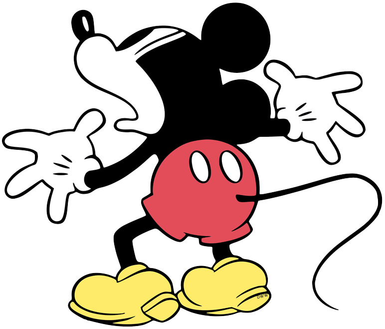
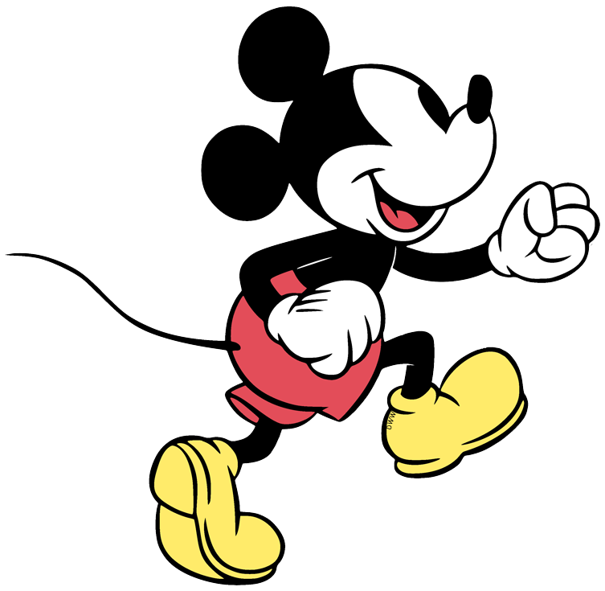

<!DOCTYPE html>
<html lang="en">
<head>
  <meta charset="UTF-8">
  <meta name="viewport" content="width=device-width, initial-scale=1.0">

  <title>Mai Websait</title>

  
</head>

<body>

  <!-- Welcome screen -->
  

    welcom tu mai websait
  

  <!-- Website title -->
  

    mai websait :D
  

  <!-- Mickey PNGs -->
  
  

  

</body>
</html>
